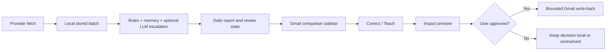

<p align="center">
  
</p>

<p align="center">
  <strong>Human-in-the-loop AI inbox triage before provider-side action.</strong>
</p>

<p align="center">
  
</p>

<p align="center">
  <em>Demo uses synthetic Gmail-style data. No private email, credentials, or real unsubscribe execution are shown.</em>
</p>

Threadwise is a local-first prototype for AI-assisted inbox triage. It combines deterministic rules, optional model-assisted classification, a browser-side inbox companion, and explicit human review before broader provider-side changes.

The product bet is simple: let the agent do the repetitive first pass, but keep the user in control when a decision could affect real inbox state. The strongest loop is the one shown above: classify an email, explain the decision, accept a correction in context, preview broader impact, and wait for confirmation before changing more than the current message.

Start here if you want the public project story:

- [Portfolio overview](docs/portfolio.md)
- [Current product direction](docs/v2-alignment.md)
- [Current bounded PRD](docs/prd.md)
- [Current operating checkpoint](docs/checkpoints/current-operating-model-2026-06-22.md)

## What The Demo Shows

- Gmail-first inbox companion beside the message list
- Selected-email rationale in plain English
- `Correct / Teach` flow for telling the agent what it got wrong
- Broader-impact preview before changing matching emails
- Unsubscribe cleanup that waits for confirmation
- Roadmap framing for future inbox-agnostic support without claiming it is already shipped

## What It Does Today

- Gmail-first companion flow with a browser sidebar attached to the inbox
- Selected-email classification, short rationale, and teaching preview
- Daily run workflow with bounded Gmail label write-back
- Limited Gmail `INBOX` removal for already-approved low-value categories only
- ProtonMail read-only fetch and reporting path
- Daily and weekly reporting from local run artifacts
- Unsubscribe inventory plus explicit, auditable follow-up flows

## Why It Exists

Email is full of repetitive triage work, but fully autonomous inbox action is easy to over-claim and hard to trust.

Threadwise explores a narrower product bet:

- let automation do the repetitive first pass
- keep the human in the loop for corrections and broader changes
- make learning visible instead of silent
- keep provider-side actions bounded and explicit

## Architecture Choices

Threadwise is built as a supervised inbox workflow, not as a general autonomous email operator.



Key choices:

- **Local-first artifacts:** fetched messages, review decisions, reports, write status, unsubscribe inventory, and teaching memory are stored locally so every action can be inspected.
- **Provider adapters, not a generic platform:** Gmail is the current write-capable release target. ProtonMail exists as a read-only path. The roadmap keeps provider-neutral data shapes where useful without pretending every inbox is already supported.
- **Rules before model calls:** deterministic classification and accepted teaching memory run first. OpenAI Chat Completions are available in optional evaluation/runtime-cascade paths when a model is explicitly configured, but the product does not depend on silent model autonomy for every action.
- **A browser companion as the product surface:** the sidebar sits next to Gmail so correction happens where the user sees the mistake.
- **Explicit mutation gates:** label write-back and limited `INBOX` removal are bounded. Broader rewrites, unsubscribe execution, and uncertain cases require user approval or stay visible.
- **Demo assets are deterministic:** the public GIF is generated from a synthetic capture stage so the README is understandable without setup and does not expose private inbox data.

## Current vs Roadmap

| Area | Current | Roadmap |
| --- | --- | --- |
| Gmail | Label write-back, limited `INBOX` removal, companion sidebar, teaching preview, unsubscribe review | More polished extension packaging and daily-use hardening |
| ProtonMail | Read-only fetch/reporting path | Carry the same supervised loop into a second inbox |
| Outlook / Hotmail | Experimental/readiness work only | Later inbox-agnostic support |
| Autonomy | Bounded labels and low-value inbox removal | No broad delete, send, reply, or full autonomous inbox operation by default |

## Safety Boundaries

- This repo does not claim full inbox autonomy.
- It does not default to deleting, trashing, broadly archiving, or sending email.
- It does not claim phishing or security-grade detection.
- ProtonMail is currently read-only.
- Broader existing-message rewrites are previewed first and require confirmation.

## Proof Points For Reviewers

- Product loop: [demo GIF](docs/assets/threadwise-recruiter-story.gif)
- Portfolio framing: [docs/portfolio.md](docs/portfolio.md)
- Current product direction: [docs/v2-alignment.md](docs/v2-alignment.md)
- Current bounded PRD: [docs/prd.md](docs/prd.md)
- Operating checkpoint: [docs/checkpoints/current-operating-model-2026-06-22.md](docs/checkpoints/current-operating-model-2026-06-22.md)
- Gmail autonomy decision: [docs/decisions/gmail-bounded-autonomy.md](docs/decisions/gmail-bounded-autonomy.md)

## Repo Guide

- `src/`: core classification, provider adapters, review/runtime logic, companion UI server
- `scripts/`: runnable entrypoints for Gmail, ProtonMail, reports, harnesses, and local tools
- `extensions/`: browser companion code
- `tests/`: behavior and contract tests
- `docs/`: product docs, PRDs, checkpoints, issues, handoffs, and portfolio framing
- `examples/`: safe sample inputs and config examples

## Running It Locally

Current preferred commands stay here, lower in the README because this repo is also a portfolio artifact.

Gmail daily workflow:

```bash
python3 scripts/daily_live_gmail_run.py --account-id founder-test --batch-size 50
```

ProtonMail read-only daily workflow:

```bash
python3 scripts/daily_live_protonmail_run.py --account-id founder-proton --batch-size 25
```

Weekly per-inbox report:

```bash
python3 scripts/weekly_inbox_report.py --account-id founder-test --storage-dir data/gmail_fetch --end-date 2026-06-20
```

Local browser review / workbench:

```bash
python3 scripts/review_local_batch_in_browser.py --batch-id founder-test-batch-N --port 8001
```

Operational readiness check:

```bash
python3 scripts/check_operational_readiness.py
```

More operational detail:

- [Current operational readiness note](docs/current-operational-readiness-2026-06-29.md)
- [Current operating model checkpoint](docs/checkpoints/current-operating-model-2026-06-22.md)
- [Historical Gmail MVP guide](docs/archive/mvp-happy-path-gmail-manual-review.md)

## Private Local Data

This repo uses local private data paths such as:

- `data/gmail_credentials/`
- `data/gmail_fetch/`
- `data/protonmail_credentials/protonmail_bridge/<account_id>.json`

These paths are local-only and should not be committed.
