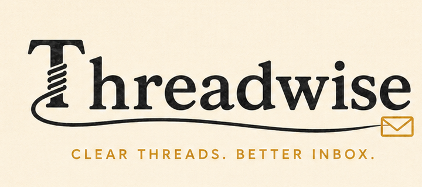
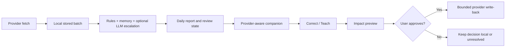

<p align="center">
  
</p>

<p align="center">
  <strong>Human-in-the-loop AI inbox triage before provider-side action.</strong>
</p>

<p align="center">
  <a href="https://czzzry.github.io/threadwise/"><strong>Try the hosted synthetic demo</strong></a>
  ·
  <a href="docs/portfolio.md">Read the product overview</a>
</p>

<p align="center">
  <em>Demo uses synthetic Gmail-style data. No private email or credentials are shown.</em>
</p>

Threadwise is a local-first prototype for AI-assisted inbox triage. It combines deterministic rules, optional model-assisted classification, a browser-side inbox companion, and explicit human review before broader provider-side changes.

The product bet is simple: let the agent do the repetitive first pass, but keep the user in control when a decision could affect real inbox state. The strongest loop is available in the hosted synthetic demo: classify an email, explain the decision, accept a correction in context, preview broader impact, and wait for confirmation before changing more than the current message.

Start here for the product story and the current operating model:

- [Hosted synthetic demo](https://czzzry.github.io/threadwise/)
- [Product overview](docs/portfolio.md)
- [Current product direction](docs/v2-alignment.md)
- [Current Gauntlet PRD](docs/prd-threadwise-gauntlet-2026-08-09.md)
- [Current operating checkpoint](docs/checkpoints/current-operating-model-2026-06-22.md)
- [Fresh Mac setup](docs/fresh-mac-setup.md)

## What The Demos Show

The hosted synthetic demo covers:

- Gmail-style inbox companion beside the message list
- Selected-email rationale in plain English
- `Correct / Teach` flow for telling the agent what it got wrong
- Broader-impact preview before changing matching emails
- Explicit current-message, future-only, matching-message, and cancel outcomes
- Truthful synthetic receipts without claiming provider access or mutation

The hosted synthetic demo focuses on selected-email reasoning, guided correction, broader-impact preview, and explicit scope choice. Approved changes appear on the matching inbox rows and in derived folder counts; future-only and confirmation paths show their outcome without pretending to relabel existing mail. It runs entirely on browser-local synthetic data and cannot access a provider inbox.

## What It Does Today

- One provider-neutral companion workflow with provider-scoped Gmail and ProtonMail state
- Selected-email classification, short rationale, and teaching preview
- Daily run workflow with bounded Gmail label write-back
- Limited Gmail `INBOX` removal for already-approved low-value categories only
- ProtonMail read-only fetch/reporting plus a bounded label-only review console
- Daily and weekly reporting from local run artifacts
- Explicitly configured model-assisted initial suggestions that remain pending for review
- Read-only Gmail coverage with a provider-scoped review queue
- Fast review advancement with truthful background-write receipts, retry, and reconciliation
- Exact one-to-three-label selected-email correction with `only`, `add`, `remove`, and `replace`; broader multi-label scope remains deferred

## Why It Exists

Email is full of repetitive triage work, but fully autonomous inbox action is easy to over-claim and hard to trust.

Threadwise explores a narrower product bet:

- let automation do the repetitive first pass
- keep the human in the loop for corrections and broader changes
- make learning visible instead of silent
- keep provider-side actions bounded and explicit

## Architecture Choices

Threadwise is built as a supervised inbox workflow, not as a general autonomous email operator.


```mermaid
flowchart LR
    A[Provider fetch] --> B[Local stored batch]
    B --> C[Rules + memory + optional LLM escalation]
    C --> D[Daily report and review state]
    D --> E[Provider-aware companion]
    E --> F[Correct / Teach]
    F --> G[Impact preview]
    G --> H{User approves?}
    H -- Yes --> I[Bounded provider write-back]
    H -- No --> J[Keep decision local or unresolved]
```

Key choices:

- **Local-first artifacts:** fetched messages, review decisions, reports, write status, and teaching memory are stored locally so every current action can be inspected. Historical unsubscribe artifacts remain preserved locally but are not exposed as product actions.
- **Provider adapters, not a generic platform:** Gmail remains the primary write-capable release target. ProtonMail has read paths plus one bounded label-only Bridge review action; broader provider behavior remains out of scope.
- **Rules before model calls:** deterministic classification and accepted teaching memory run first. OpenAI Chat Completions are available for explicitly configured review-only initial suggestions and optional evaluation/runtime-cascade paths, but the product does not depend on silent model autonomy for every action.
- **A browser companion as the product surface:** the sidebar sits next to Gmail so correction happens where the user sees the mistake.
- **Explicit mutation gates:** label write-back and limited `INBOX` removal are bounded. Broader rewrites require preview and user approval; unsubscribe execution and destructive suspicious-sender actions are unavailable.
- **Demo data is deterministic:** the hosted interaction runs entirely on browser-local synthetic data, needs no setup, and cannot expose a private inbox.

## Current vs Roadmap

| Area | Current | Roadmap |
| --- | --- | --- |
| Gmail | Label write-back, limited `INBOX` removal, companion sidebar, teaching preview, read-only coverage | More polished extension packaging and daily-use hardening |
| ProtonMail | Read-only fetch/reporting plus a bounded label-only review console | Live acceptance and provider-parity hardening |
| Outlook / Hotmail | Experimental/readiness work only | Later inbox-agnostic support |
| Autonomy | Bounded labels and low-value inbox removal | No broad delete, send, reply, or full autonomous inbox operation by default |

## Safety Boundaries

- This repo does not claim full inbox autonomy.
- It does not default to deleting, trashing, broadly archiving, or sending email.
- It does not claim phishing or security-grade detection.
- It exposes no unsubscribe execution or destructive suspicious-sender action; `List-Unsubscribe` is classification evidence only.
- ProtonMail writes are limited to the bounded, verified label-only review-console operation.
- Broader existing-message rewrites are previewed first and require confirmation.

## Product And Engineering Notes

- Hosted interaction: [synthetic inbox demo](https://czzzry.github.io/threadwise/)
- Product overview: [docs/portfolio.md](docs/portfolio.md)
- Current product direction: [docs/v2-alignment.md](docs/v2-alignment.md)
- Current Gauntlet PRD: [docs/prd-threadwise-gauntlet-2026-08-09.md](docs/prd-threadwise-gauntlet-2026-08-09.md)
- Operating checkpoint: [docs/checkpoints/current-operating-model-2026-06-22.md](docs/checkpoints/current-operating-model-2026-06-22.md)
- Gmail autonomy decision: [docs/decisions/gmail-bounded-autonomy.md](docs/decisions/gmail-bounded-autonomy.md)

## Repo Guide

- `src/`: core classification, provider adapters, review/runtime logic, companion UI server
- `scripts/`: runnable entrypoints for Gmail, ProtonMail, reports, harnesses, and local tools
- `extensions/`: browser companion code
- `tests/`: behavior and contract tests
- `docs/`: product docs, PRDs, checkpoints, issues, handoffs, and decision history
- `examples/`: safe sample inputs and config examples

## Running It Locally

### Safe synthetic demo

The fastest local demo runs only the committed synthetic inbox. It disables Gmail write-through and live Gmail checks by construction.

With Docker:

```bash
make demo
```

Then open [http://localhost:8031/simulator](http://localhost:8031/simulator). Stop it with `make demo-down`.

Without Docker:

```bash
python3 scripts/run_gmail_companion_simulator.py
```

The Docker image is intentionally limited to the simulator. The real extension, OAuth, and local provider bridges remain native because containerizing those paths would add access friction without improving their safety or fidelity.

### Private local workflows

The commands below operate only after the user supplies their own local credentials and account identifiers. They are not required for the public demos.

Gmail daily workflow:

```bash
python3 scripts/daily_live_gmail_run.py --account-id <local-gmail-id> --batch-size 50
```

ProtonMail incremental, label-only daily workflow:

```bash
python3 scripts/daily_live_protonmail_run.py --account-id <local-proton-id> --batch-size 25
```

On the founder's Mac, `scripts/manage_threadwise_startup.py install` also installs
`com.threadwise.proton-daily`, which runs this incremental check at 6:00 each day.
Already processed messages are skipped before classification. Threadwise Start/Stop
controls both the companion and this schedule.

Weekly per-inbox report:

```bash
python3 scripts/weekly_inbox_report.py --account-id <local-gmail-id> --storage-dir data/gmail_fetch --end-date 2026-06-20
```

Local browser review / workbench:

```bash
python3 scripts/review_local_batch_in_browser.py --batch-id <local-batch-id> --port 8001
```

Operational readiness check:

```bash
python3 scripts/check_operational_readiness.py
```

More operational detail:

- [Current operational readiness note](docs/current-operational-readiness-2026-06-29.md)
- [Current operating model checkpoint](docs/checkpoints/current-operating-model-2026-06-22.md)
- [Historical Gmail MVP guide](docs/archive/mvp-happy-path-gmail-manual-review.md)

## Private Local Data

This repo uses local private data paths such as:

- `data/gmail_credentials/`
- `data/gmail_fetch/`
- `data/protonmail_credentials/protonmail_bridge/<account_id>.json`

These paths are local-only and should not be committed.

All committed fixtures and demo assets must use synthetic or transformed data.
The rules for public examples, private local data, and the automated CI guardrail are documented in [Public Data Policy](docs/public-data-policy.md).

## License

Source code and original documentation are MIT licensed. Threadwise brand assets and demo media have separate reuse boundaries documented in [ASSET_NOTICE.md](ASSET_NOTICE.md).
