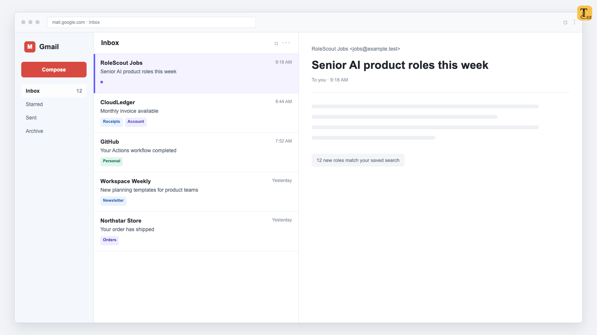
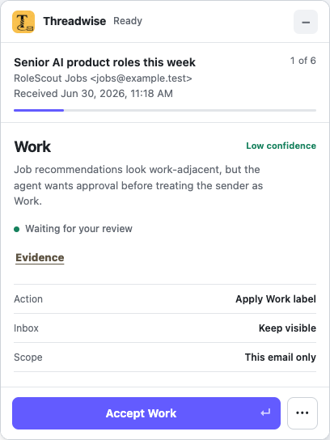
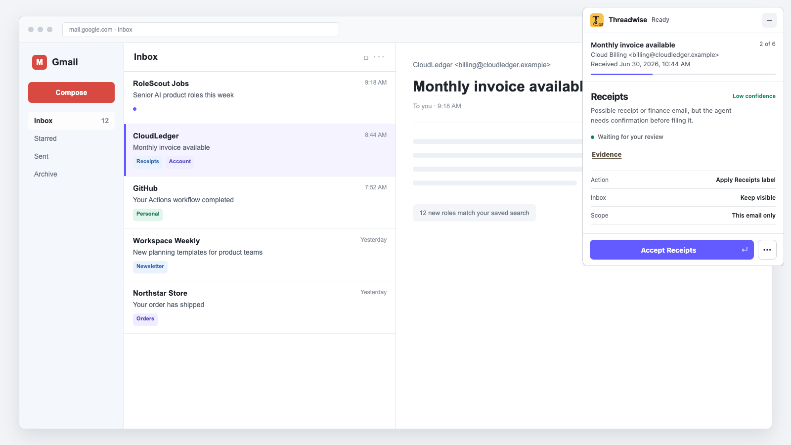
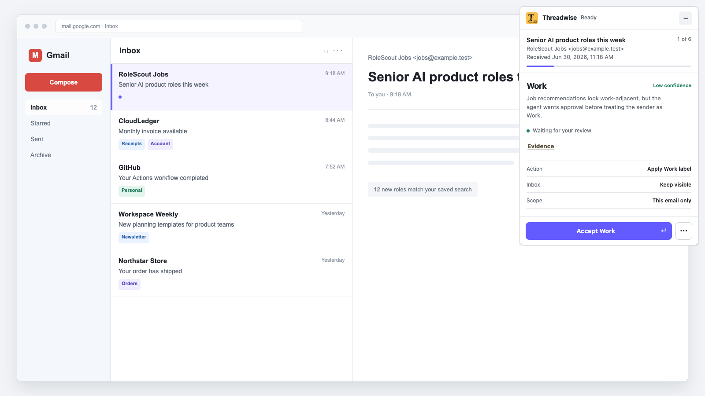
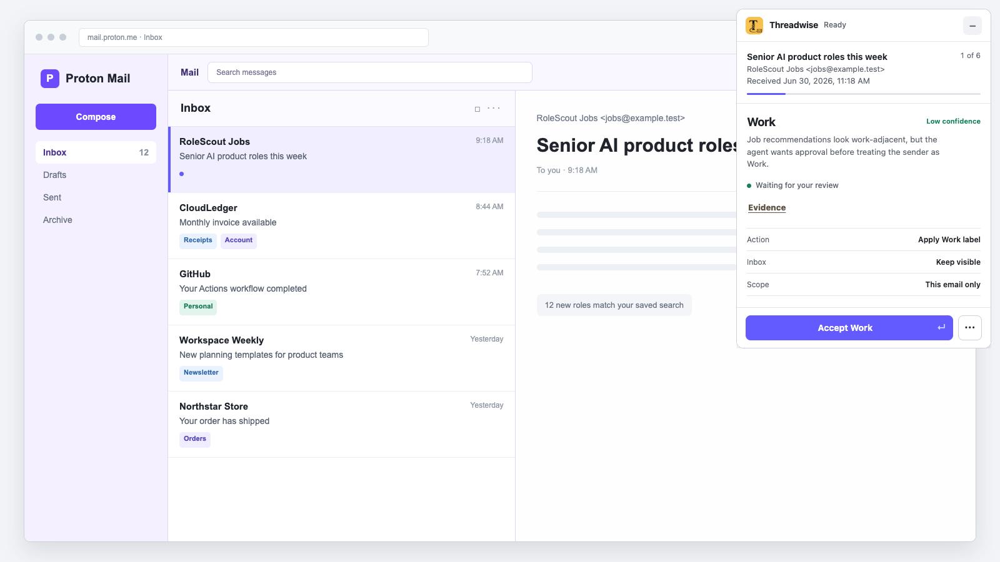
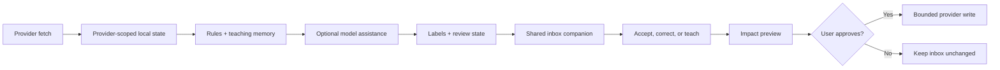

<h1 align="center">Threadwise</h1>

<p align="center">
  <strong>Your inbox, quietly sorted.</strong>
</p>

<p align="center">
  One human-in-the-loop email triage companion for Gmail and Proton Mail.
</p>

<p align="center">
  <a href="https://czzzry.github.io/threadwise/"><strong>See Threadwise in action</strong></a>
  &nbsp;&middot;&nbsp;
  <a href="docs/portfolio.md">Product overview</a>
  &nbsp;&middot;&nbsp;
  <a href="#run-it-locally">Run locally</a>
</p>



Threadwise labels routine mail in the background and stays out of the way. When a decision needs you, the same companion opens inside the inbox you already use. You see the email, Threadwise's reasoning, and the exact action together before approving, correcting, or teaching it.

The product is local-first and deliberately bounded. It handles repetitive triage, but broader provider-side changes remain visible, previewable, and under human control.

## One Calm Review Flow



1. **Threadwise labels the obvious mail.** Accepted rules and memory run before optional model assistance.
2. **Uncertain decisions come to you.** The companion explains its suggestion in the context of the message.
3. **You choose the scope.** Fix one email, teach future matches, or preview matching inbox changes.
4. **The next email is ready.** Approved work reconciles in the background while review continues.



## Same Threadwise, Both Inboxes

Provider identity and provider-side behavior stay separate. The interaction model does not.

### Gmail



### Proton Mail




## Try It Without an Inbox

The [hosted synthetic demo](https://czzzry.github.io/threadwise/) lets you inspect a classification, correct it, preview broader impact, and choose an explicit scope. It uses browser-local synthetic data, makes no network request, has no credentials, and cannot access or change a provider inbox.

## What It Does Today

- One provider-neutral companion workflow with provider-scoped Gmail and Proton Mail state
- Background classification using accepted rules, teaching memory, and optional model assistance
- Selected-email rationale, confidence, action, inbox behavior, and scope
- Fast review advancement with provider-write reconciliation and retry receipts
- Gmail label write-back plus limited inbox removal for approved low-value categories
- Proton Mail Bridge fetch, synchronized companion state, and bounded label-only writes
- Incremental scheduled runs that skip already processed messages before classification
- Exact one-to-three-label selected-email correction using `only`, `add`, `remove`, or `replace`
- Readable local artifacts for review state, decisions, teaching memory, and write status

## Product Boundary

Threadwise is a supervised triage product, not a general autonomous email operator.

- It does not default to deleting, trashing, broadly archiving, sending, or replying.
- It does not claim phishing or security-grade detection.
- `List-Unsubscribe` is classification evidence only; unsubscribe execution is unavailable.
- Broader existing-message changes are previewed and require explicit approval.
- Provider state remains isolated so Gmail history cannot populate a Proton Mail queue, or vice versa.

## How It Fits Together


```mermaid
flowchart LR
    A[Provider fetch] --> B[Provider-scoped local state]
    B --> C[Rules + teaching memory]
    C --> D[Optional model assistance]
    D --> E[Labels + review state]
    E --> F[Shared inbox companion]
    F --> G[Accept, correct, or teach]
    G --> H[Impact preview]
    H --> I{User approves?}
    I -- Yes --> J[Bounded provider write]
    I -- No --> K[Keep inbox unchanged]
```

Key architectural choices:

- **Provider-scoped memory:** message identity, review state, and writes never share a queue across providers.
- **Rules before model calls:** accepted lessons handle known patterns; the configured model helps with ambiguous intent and deterministic misses.
- **One product surface:** Gmail and Proton Mail render the same companion contract inside their native inboxes.
- **Explicit mutation gates:** every broader write has a scope, preview, and verification path.
- **Synthetic public media:** the website and README use deterministic transformed data, never private inbox content.

## Run It Locally

### Public synthetic demo

With Docker:

```bash
make demo
```

Open [http://localhost:8031/simulator](http://localhost:8031/simulator), then stop it with `make demo-down`.

Without Docker:

```bash
python3 -m http.server 8879 --directory docs
```

Open [http://localhost:8879](http://localhost:8879). The hosted interaction is deterministic and does not need provider credentials.

### Private local workflows

The following commands require the user's own local credentials and account identifiers. They are not needed for the public demo.

Gmail daily workflow:

```bash
python3 scripts/daily_live_gmail_run.py --account-id <local-gmail-id> --batch-size 50
```

Proton Mail incremental daily workflow:

```bash
python3 scripts/daily_live_protonmail_run.py --account-id <local-proton-id> --batch-size 25
```

Operational readiness check:

```bash
python3 scripts/check_operational_readiness.py
```

Fresh machine setup and service controls are documented in [Fresh Mac setup](docs/fresh-mac-setup.md).

## Project Guide

- `src/`: classification, provider adapters, review state, runtime logic, and companion server
- `extensions/`: the shared browser companion
- `scripts/`: daily runs, reporting, capture tooling, and local controls
- `tests/`: behavior, provider isolation, UI contracts, and public-data checks
- `docs/`: the website, product direction, PRDs, decisions, checkpoints, and handoffs
- `examples/`: synthetic fixtures and safe configuration examples

Current source-of-truth documents:

- [Product direction](docs/v2-alignment.md)
- [Current Gauntlet PRD](docs/prd-threadwise-gauntlet-2026-08-09.md)
- [Operating model checkpoint](docs/checkpoints/current-operating-model-2026-06-22.md)
- [Public data policy](docs/public-data-policy.md)

## Private Local Data

Credentials and inbox artifacts live only in ignored local paths such as `data/gmail_credentials/`, `data/gmail_fetch/`, and `data/protonmail_credentials/`. Automated public-data checks reject credential-shaped values, machine-specific paths, live-account evidence markers, and non-reserved demo email domains before changes land.

## License

Source code and original documentation are MIT licensed. Threadwise brand assets and demo media have separate reuse boundaries documented in [ASSET_NOTICE.md](ASSET_NOTICE.md).
