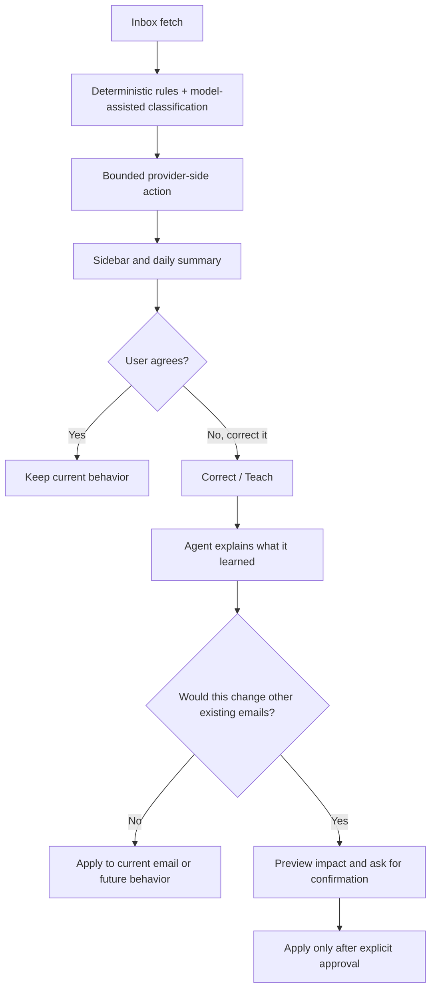

# Threadwise Portfolio Overview

Status: Public portfolio framing
Current as of: 2026-06-29

## One-Line Summary

Threadwise is a local-first AI inbox triage prototype that combines rules, model-assisted classification, inbox-native correction, and explicit human approval before broader provider-side action.

## Problem

Inbox automation is useful right up until it becomes untrustworthy.

The practical problem this project tackles is:

- too much email is repetitive to triage manually
- fully autonomous inbox action is easy to overstate and hard to trust
- most prototypes skip the human review loop and the product interaction needed to make learning safe

Threadwise focuses on the middle ground: useful automation with visible boundaries.

## What It Does Today

- Runs a Gmail-first triage workflow for one person’s inbox
- Classifies messages using deterministic rules plus model-assisted logic
- Writes bounded Gmail labels back to the provider
- Removes Gmail `INBOX` only for already-approved low-value categories
- Shows a browser-based inbox companion beside Gmail
- Explains the selected email’s current classification in plain English
- Lets the user correct the agent in context
- Previews when a correction would affect other existing emails
- Requires confirmation before wider existing-message changes
- Produces daily and weekly local reports
- Supports ProtonMail as a read-only import/live-fetch path for MVP+1 groundwork
- Builds unsubscribe inventory and supports explicit, auditable follow-up

## Workflow

## Human Review And Safety Boundaries

This project is intentionally narrower than a “fully autonomous email agent.”

Current boundaries:

- Human-visible review is part of the product, not a fallback afterthought.
- Broader changes to existing email require confirmation first.
- Gmail actions are bounded to label write-back and limited `INBOX` removal for approved low-value categories.
- ProtonMail is read-only today.
- Unsubscribe actions are explicit and auditable.
- Delete, trash, broad archive, send, and reply automation are out of scope.
- This repo does not claim phishing detection or security-grade classification.

## What I Personally Built / Directed

This repository is intended to show builder-operator work more than classic software-engineering branding.

The work represented here includes:

- product direction for a human-in-the-loop inbox agent rather than a dashboard-only workflow
- workflow design for correction, preview, confirmation, and bounded learning
- practical automation across Gmail, reporting, unsubscribe inventory, and ProtonMail read-only flows
- local browser companion and acceptance harness work
- classification feedback loops that combine deterministic logic with model-assisted judgment
- documentation, checkpoints, and decision-making around trust boundaries

## Current Limitations

- Local-first prototype, not hosted SaaS
- Single-user focus, not team/shared inboxes
- Gmail is the main release target; ProtonMail write-side behavior is not implemented
- Public screenshots and polished demo assets are still incomplete
- The repo still contains historical internal planning and handoff material that is useful for process evidence but not all recruiter-readable
- Some operational tooling is intentionally rough because it exists to prove workflows, not to present a finished commercial product

## What This Repo Does Not Claim To Be

- not a production-grade SaaS platform
- not a fully autonomous inbox operator
- not a security product
- not a shipping-ready multi-tenant architecture
- not proof of enterprise deployment or large-scale ML operations
- not an attempt to present the author as a pure professional SWE or ML engineer

## Recommended Demo Artifacts

If publishing this repo publicly, add a small `/demo` or screenshot section with:

1. Sidebar open on one selected message
2. `Correct / Teach` flow with a short explanation entered
3. Impact preview showing “this would change X other emails”
4. Confirmation options:
   `Apply only here`, `Apply to matching emails too`, `Use for future emails only`, `Refine this`
5. Compact daily summary view
6. Unsubscribe inventory / follow-up view

Recommended file naming:

- `docs/assets/threadwise-sidebar-selected-email.png`
- `docs/assets/threadwise-teach-preview.png`
- `docs/assets/threadwise-daily-summary.png`
- `docs/assets/threadwise-unsubscribe-flow.png`

## Best Public Reading Order

1. [README.md](../README.md)
2. [docs/portfolio.md](portfolio.md)
3. [docs/v2-alignment.md](v2-alignment.md)
4. [docs/checkpoints/current-operating-model-2026-06-22.md](checkpoints/current-operating-model-2026-06-22.md)
