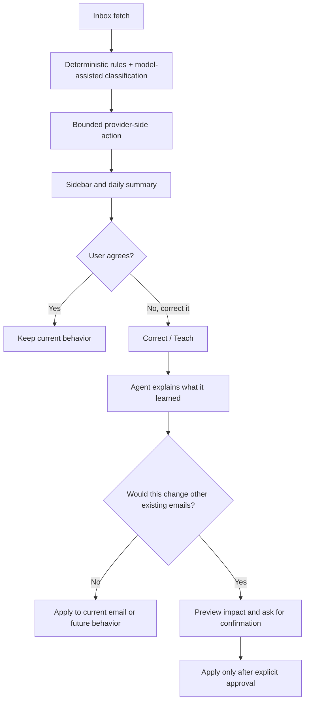

# Threadwise Product Overview

Status: Public product overview
Current as of: 2026-06-30

## One-Line Summary

Threadwise is a local-first AI inbox triage prototype that combines rules, model-assisted classification, inbox-native correction, and explicit human approval before broader provider-side action.

## Product Walkthrough

The public demo uses synthetic Gmail-style data. It shows the core product loop without requiring setup:

- Threadwise classifies and explains a selected Gmail message.
- The user teaches a correction in plain English.
- The agent previews broader impact before changing matching emails.
- Unsubscribe cleanup waits for explicit confirmation.
- The final roadmap frame shows inbox-agnostic direction as future work, not shipped scope.

## Problem

Inbox automation is useful right up until it becomes untrustworthy.

The practical problem this project tackles is:

- too much email is repetitive to triage manually
- fully autonomous inbox action is easy to overstate and hard to trust
- most prototypes skip the human review loop and the product interaction needed to make learning safe

Threadwise focuses on the middle ground: useful automation with visible boundaries.

## What It Does Today

- Runs a Gmail-first triage workflow for one person’s inbox
- Classifies messages using deterministic rules plus model-assisted logic
- Writes bounded Gmail labels back to the provider
- Removes Gmail `INBOX` only for already-approved low-value categories
- Shows a browser-based inbox companion beside Gmail
- Explains the selected email’s current classification in plain English
- Lets the user correct the agent in context
- Previews when a correction would affect other existing emails
- Requires confirmation before wider existing-message changes
- Produces daily and weekly local reports
- Supports ProtonMail as a read-only import/live-fetch path for MVP+1 groundwork
- Builds unsubscribe inventory and supports explicit, auditable follow-up

## Workflow

## Architecture In Plain English

Threadwise is organized around trust boundaries:

- **Fetch and normalize:** provider-specific fetchers pull mail into local stored batches. Gmail is the write-capable release target; ProtonMail is read-only.
- **Classify with layers:** deterministic rules and accepted teaching memory run first. Optional OpenAI Chat Completions paths exist for evaluation/runtime escalation when a model is explicitly configured.
- **Store evidence locally:** batches, review decisions, reports, write status, unsubscribe candidates, and teaching memory are local artifacts so runs can be inspected and replayed.
- **Show decisions in context:** the Gmail companion sidebar explains the selected email and exposes correction where the user sees the mistake.
- **Gate provider actions:** label writes, limited `INBOX` removal, broader rewrites, and unsubscribe execution are bounded by explicit rules and approvals.

This is intentionally not a generic autonomous agent platform. The architecture prioritizes user control, auditability, and a credible single-user inbox workflow.

## Human Review And Safety Boundaries

This project is intentionally narrower than a “fully autonomous email agent.”

Current boundaries:

- Human-visible review is part of the product, not a fallback afterthought.
- Broader changes to existing email require confirmation first.
- Gmail actions are bounded to label write-back and limited `INBOX` removal for approved low-value categories.
- ProtonMail is read-only today.
- Unsubscribe actions are explicit and auditable.
- Delete, trash, broad archive, send, and reply automation are out of scope.
- This repo does not claim phishing detection or security-grade classification.

## Ownership

The work represented here includes:

- product direction for a human-in-the-loop inbox agent rather than a dashboard-only workflow
- workflow design for correction, preview, confirmation, and bounded learning
- practical automation across Gmail, reporting, unsubscribe inventory, and ProtonMail read-only flows
- local browser companion and acceptance harness work
- classification feedback loops that combine deterministic logic with model-assisted judgment
- documentation, checkpoints, and decision-making around trust boundaries

## Current Limitations

- Local-first prototype, not hosted SaaS
- Single-user focus, not team/shared inboxes
- Gmail is the main release target; ProtonMail write-side behavior is not implemented
- Public README demo asset exists; static screenshot packaging is still a follow-up
- Historical planning and handoff material remains available for traceability, while the README and current product docs provide the shortest path through the project
- Some operational tooling is intentionally rough because it exists to prove workflows, not to present a finished commercial product

## What This Repo Does Not Claim To Be

- not a production-grade SaaS platform
- not a fully autonomous inbox operator
- not a security product
- not a shipping-ready multi-tenant architecture
- not proof of enterprise deployment or large-scale ML operations

## Demo Assets

- Primary README GIF: `docs/assets/threadwise-recruiter-story.gif`
- Selected slower/prominent variant: `docs/assets/threadwise-recruiter-story-v2-slower-prominent.gif`
- Saved baseline variant: `docs/assets/threadwise-recruiter-story-v1-liked-baseline.gif`
- Capture stage: `docs/assets/demo-stage/threadwise-recruiter-story-stage.html`
- Capture script: `scripts/capture_threadwise_recruiter_story_asset.mjs`

Static screenshots can still be added after the GIF direction is fully accepted in README context.

## Recommended Reading Order

1. [README.md](../README.md)
2. [docs/portfolio.md](portfolio.md)
3. [docs/v2-alignment.md](v2-alignment.md)
4. [docs/checkpoints/current-operating-model-2026-06-22.md](checkpoints/current-operating-model-2026-06-22.md)
