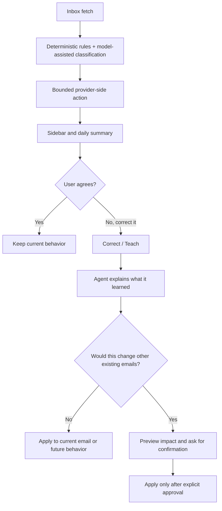

# Threadwise Product Overview

Status: Public product overview
Current as of: 2026-08-20

## One-Line Summary

Threadwise is a local-first AI inbox triage prototype that combines rules, optional model-assisted classification, inbox-native correction, and explicit human approval before broader provider-side action.

## Product Demo

The [hosted synthetic demo](https://czzzry.github.io/threadwise/) shows the current core product loop without setup or provider access. The [README](../README.md) owns the current demo entry point.

- Threadwise classifies and explains a selected Gmail-style message.
- The user teaches a correction in plain English.
- The agent previews broader impact before changing matching emails.
- The demo makes explicit current-message, future-only, matching-message, and cancel outcomes.
- Synthetic receipts never claim real provider access or mutation.

## Problem

Inbox automation is useful right up until it becomes untrustworthy.

The practical problem this project tackles is:

- too much email is repetitive to triage manually
- fully autonomous inbox action is easy to overstate and hard to trust
- most prototypes skip the human review loop and the product interaction needed to make learning safe

Threadwise focuses on the middle ground: useful automation with visible boundaries.

## What It Does Today

- Runs one shared triage workflow in Gmail and Proton Mail
- Classifies messages using deterministic rules plus explicitly configured model assistance, then keeps uncertain labels reviewable
- Writes bounded Gmail labels back to the provider
- Removes Gmail `INBOX` only for already-approved low-value categories
- Shows a browser-based inbox companion beside Gmail
- Explains the selected email’s current classification in plain English
- Lets the user correct the agent in context
- Previews when a correction would affect other existing emails
- Requires confirmation before wider existing-message changes
- Advances review quickly while background writes retain truthful receipt, retry, and reconciliation state
- Checks inbox coverage read-only in Gmail and Proton Mail and keeps review queues provider-scoped
- Supports exact one-to-three-label selected-email `only`, `add`, `remove`, and `replace` corrections
- Produces daily and weekly local reports
- Supports ProtonMail read-only import/live-fetch plus a bounded label-only Bridge review console

## Workflow

```mermaid
flowchart TD
    A[Inbox fetch] --> B[Deterministic rules + model-assisted classification]
    B --> C[Bounded provider-side action]
    C --> D[Sidebar and daily summary]
    D --> E{User agrees?}
    E -- Yes --> F[Keep current behavior]
    E -- No, correct it --> G[Correct / Teach]
    G --> H[Agent explains what it learned]
    H --> I{Would this change other existing emails?}
    I -- No --> J[Apply to current email or future behavior]
    I -- Yes --> K[Preview impact and ask for confirmation]
    K --> L[Apply only after explicit approval]
```

## Architecture In Plain English

Threadwise is organized around trust boundaries:

- **Fetch and normalize:** provider-specific fetchers pull mail into local stored batches. Gmail is the primary write-capable release target; the [current operating checkpoint](checkpoints/current-operating-model-2026-06-22.md) owns the exact provider write boundaries.
- **Classify with layers:** deterministic rules and accepted teaching memory run first. Explicit configuration adds model-assisted best guesses for deterministic misses; low-confidence labels remain visible for review after the additive provider write.
- **Store evidence locally:** batches, review decisions, reports, write status, and teaching memory are local artifacts so runs can be inspected and replayed. Historical unsubscribe artifacts remain preserved but are not exposed as current product actions.
- **Show decisions in context:** the Gmail companion sidebar explains the selected email and exposes correction where the user sees the mistake.
- **Gate provider actions:** label writes and limited `INBOX` removal are bounded by explicit rules and approvals. Broader rewrites require preview and approval; unsubscribe execution and destructive suspicious-sender actions are unavailable.

This is intentionally not a generic autonomous agent platform. The architecture prioritizes user control, auditability, and a credible single-user inbox workflow.

## Human Review And Safety Boundaries

This project is intentionally narrower than a “fully autonomous email agent.”

Current boundaries:

- Human-visible review is part of the product, not a fallback afterthought.
- Broader changes to existing email require confirmation first.
- Gmail actions are bounded to label write-back and limited `INBOX` removal for approved low-value categories.
- ProtonMail writes are limited to the bounded, verified label-only review-console operation.
- `List-Unsubscribe` is classification evidence only; no unsubscribe action is exposed.
- Delete, trash, broad archive, send, and reply automation are out of scope.
- This repo does not claim phishing detection or security-grade classification.

## Ownership

The work represented here includes:

- product direction for a human-in-the-loop inbox agent rather than a dashboard-only workflow
- workflow design for correction, preview, confirmation, and bounded learning
- practical automation across Gmail, reporting, and ProtonMail read and bounded label-only review flows
- local browser companion and acceptance harness work
- classification feedback loops that combine deterministic logic with model-assisted judgment
- documentation, checkpoints, and decision-making around trust boundaries

## Current Limitations

- The product remains a local-first prototype; only the synthetic demo is hosted
- Single-user focus, not team/shared inboxes
- Gmail is the main release target; ProtonMail expansion beyond the approved review-console boundary is not implemented
- Historical planning and handoff material remains available for traceability, while the README and current product docs provide the shortest path through the project
- Some operational tooling is intentionally rough because it exists to prove workflows, not to present a finished commercial product

## What This Repo Does Not Claim To Be

- not a production-grade SaaS platform
- not a fully autonomous inbox operator
- not a security product
- not a shipping-ready multi-tenant architecture
- not proof of enterprise deployment or large-scale ML operations

## Historical Recorded Walkthrough Assets

These June 2026 capture assets predate the removal of unsubscribe actions and are retained only as historical design evidence. They are not current product demos.

- Former primary README GIF: `docs/assets/threadwise-recruiter-story.gif`
- Selected slower/prominent variant: `docs/assets/threadwise-recruiter-story-v2-slower-prominent.gif`
- Saved baseline variant: `docs/assets/threadwise-recruiter-story-v1-liked-baseline.gif`
- Capture stage: `docs/assets/demo-stage/threadwise-recruiter-story-stage.html`
- Capture script: `scripts/capture_threadwise_recruiter_story_asset.mjs`

## Recommended Reading Order

1. [README.md](../README.md)
2. [docs/portfolio.md](portfolio.md)
3. [docs/v2-alignment.md](v2-alignment.md)
4. [docs/checkpoints/current-operating-model-2026-06-22.md](checkpoints/current-operating-model-2026-06-22.md)
