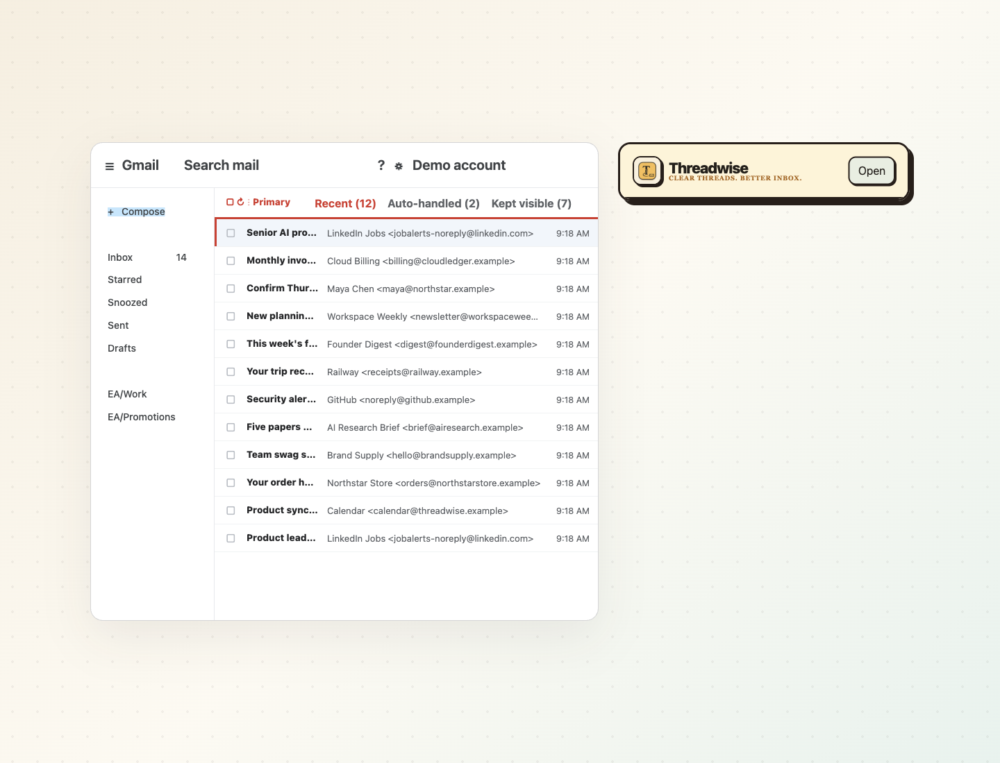
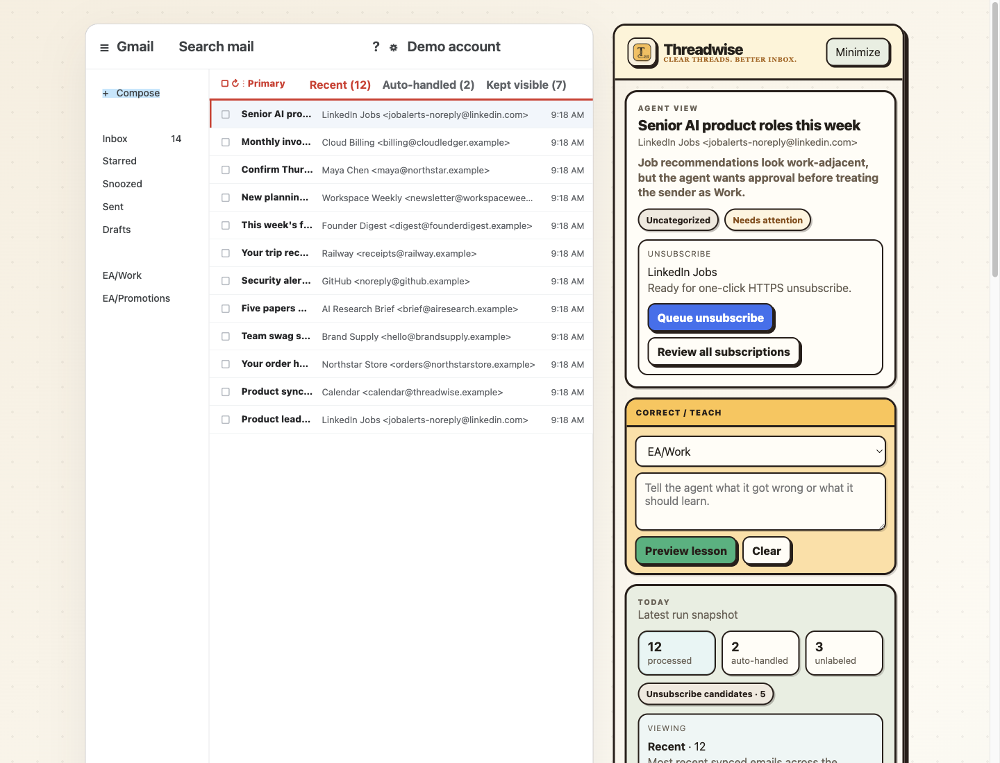
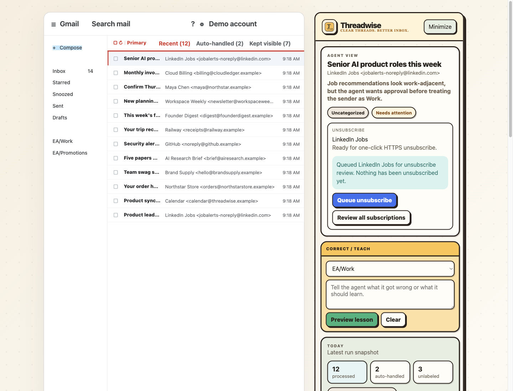
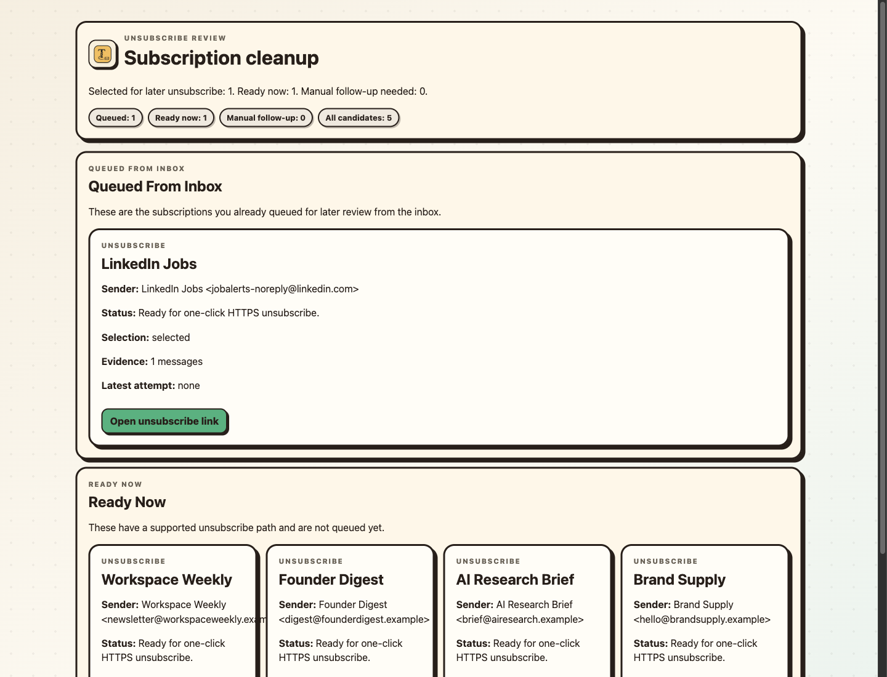
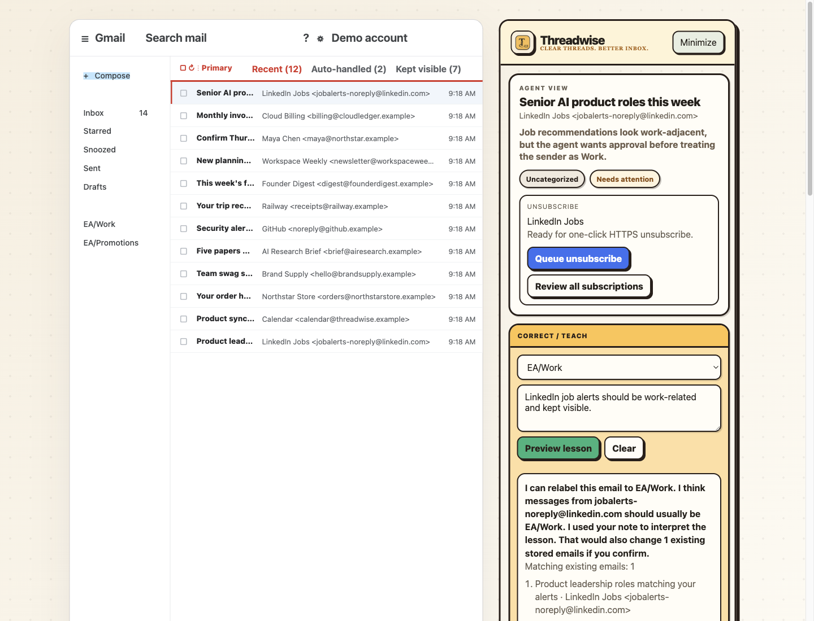
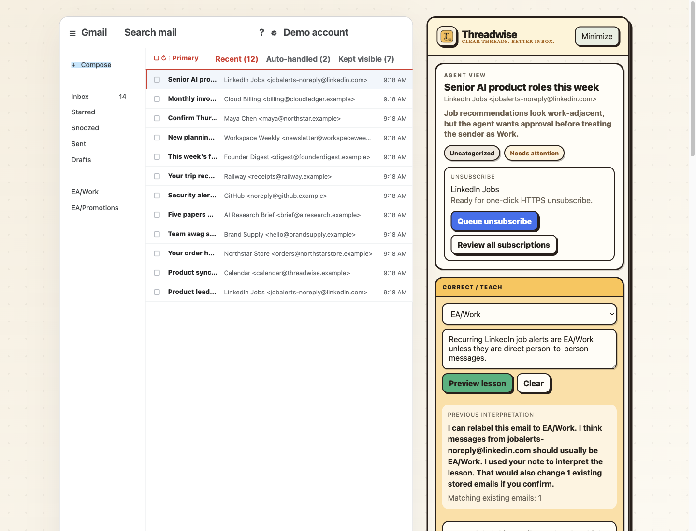
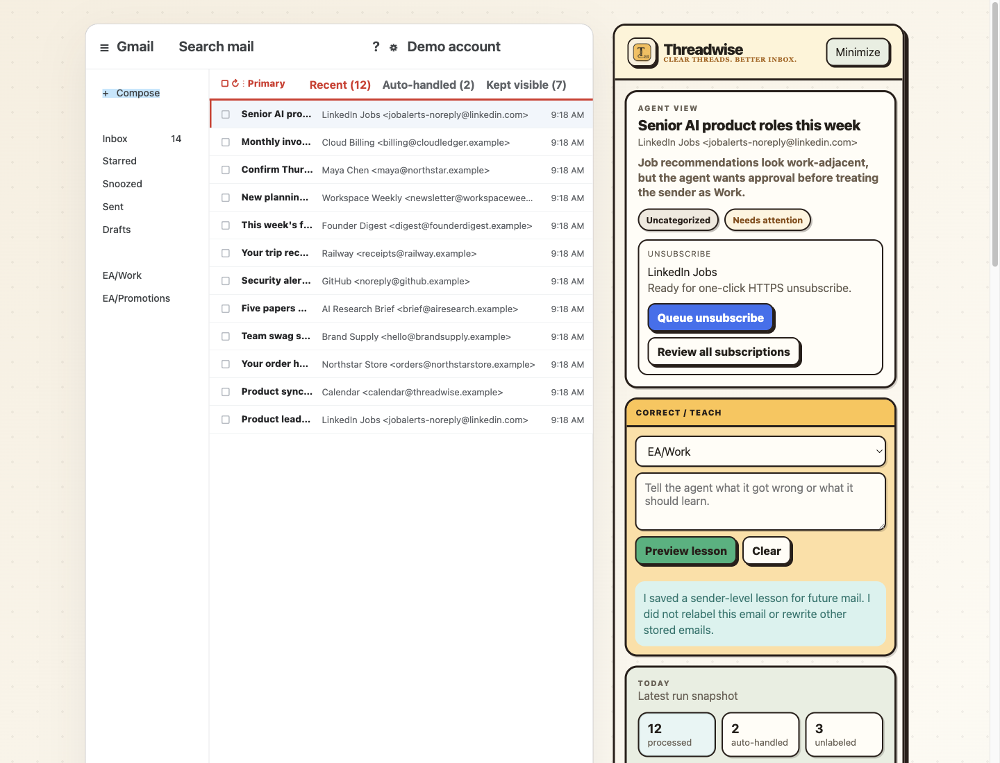
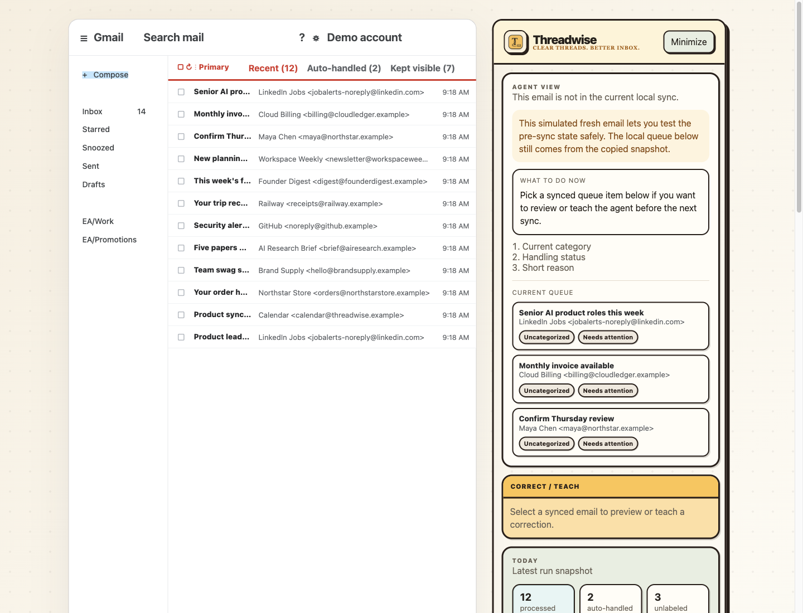
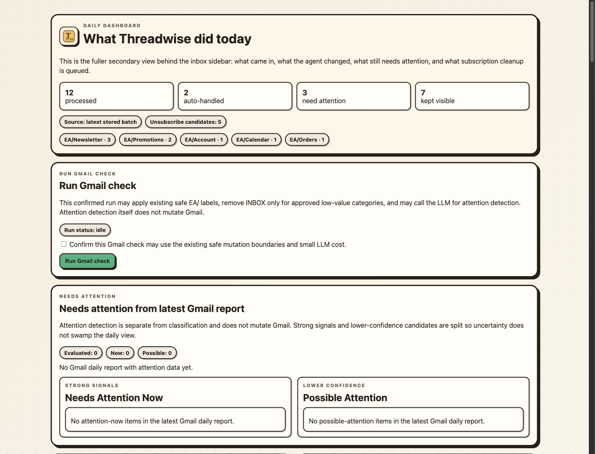

# Threadwise Browser-Extension Sidebar UI/UX Audit

Status: Read-only audit
Current as of: 2026-07-01
Scope: Existing Gmail companion/sidebar UI, using the safe local simulator plus source inspection for extension-only states.

## Evidence Captured

Screenshots live in `docs/ui-ux-audit/screenshots/`.

- `01-simulator-default-selected-email.png`
- `02-simulator-minimized-entry.png`
- `03-filter-kept-visible-list.png`
- `04-classification-and-unsubscribe-present.png`
- `05-unsubscribe-queued-state.png`
- `06-correction-start-note-filled.png`
- `07-correction-preview-impact.png`
- `08-correction-refine-compare.png`
- `09-learning-confirmation-future-rule.png`
- `10-unsynced-message-error-state.png`
- `11-daily-dashboard-supporting-surface.png`
- `12-unsubscribe-review-supporting-surface.png`

Inspected runtime path:

- Browser extension: `extensions/gmail_companion/manifest.json`
- Gmail content script/sidebar: `extensions/gmail_companion/content.js`
- Local companion server and simulator: `src/gmail_companion_ui.py`
- Existing simulator automation: `scripts/validate_gmail_companion_simulator_cdp.mjs`

Launch/capture notes:

- The UI is a plain Manifest V3 browser extension content script, not React/Vite/Storybook.
- The sidebar is injected into Gmail by `extensions/gmail_companion/content.js`.
- The companion data server is a Python `ThreadingHTTPServer` served by `src/gmail_companion_ui.py`.
- A safe rendered simulator exists at `http://127.0.0.1:8031/simulator` through `scripts/run_gmail_companion_simulator.py`.
- I did not open live Gmail or inspect private email.
- I did not implement UI/code changes.

## 1. Executive Summary

The current sidebar is trying to tell a strong story: Threadwise watches the current email, explains what the agent thinks, offers safe correction/teaching, and shows what happened today. That story is directionally right and the aesthetic is distinctive enough to preserve: thick ink borders, warm paper backgrounds, compact cards, strong buttons, small uppercase section labels, and a tactile "tool attached to Gmail" feeling.

The story is not yet clear because too many stories are visible at the same time. In the default selected-email state, the user sees the current email judgment, unsubscribe action, correction workbench, daily metrics, changed-today report, links, label counts, source/debug text, and queue list in one vertical stream. See `01-simulator-default-selected-email.png`.

Top 5 problems:

1. The sidebar does not pick a single primary job per moment. Classification, unsubscribe, teaching, report, and queue navigation compete in the same viewport.
2. Buttons are too visible and too similarly weighted. "Queue unsubscribe", "Review all subscriptions", "Preview lesson", "Clear", metric buttons, dashboard links, and queue items all read as action candidates.
3. The teaching flow is powerful but workbench-like. The preview explains consequences, but the available actions compete and are partly below the fold. See `07-correction-preview-impact.png` and `08-correction-refine-compare.png`.
4. Supporting/reporting information crowds the inbox-adjacent agent view. The "Today" block is useful, but not at the current depth and density in the main sidebar.
5. Developer/product support states leak into the normal experience through raw-ish labels, source text, stored snapshot language, and test/sync wording.

What should be preserved:

- The current visual direction: warm cream/yellow/green palette, ink borders, compact cards, bold headings, brand mark, and strong tactile buttons.
- The minimized logo bar in `02-simulator-minimized-entry.png`.
- The current "Agent View" concept as the top of the sidebar.
- Plain-English reasons and confirmation language.
- Explicit safety language for unsubscribe and teaching effects.

## 2. Current User-Flow Map

### Flow A: Open Extension / Minimize

Screenshots:




Current steps:

1. User opens Gmail with Threadwise attached.
2. Sidebar appears on the right with the brand header and a "Minimize" button.
3. User can collapse it into a compact horizontal brand pill with an "Open" button.

Expected mental model:

Threadwise is an assistant attached to Gmail. It should stay out of the way unless the user needs it.

Where the UI breaks the model:

- Expanded state is too tall and dense immediately. The first viewport already includes three unrelated jobs: current email, teaching, and daily report.
- Minimized state is good, but it is a horizontal pill rather than the "very very very small" extreme minimal affordance the founder described earlier. It is acceptable but could shrink further later.

### Flow B: View Current Email Classification

Screenshots:




Current steps:

1. User selects or views an email.
2. Agent View shows subject, sender, reason, classification chip, and handling chip.
3. If an unsubscribe candidate exists, an unsubscribe card appears immediately under the judgment.

Expected mental model:

"What does Threadwise think about this email, and should I trust that?"

Where the UI breaks the model:

- The judgment is useful, but it is visually similar in weight to the unsubscribe card and teaching card below it.
- The reason text is plain-English and good, but the label chip "Uncategorized" and status chip "Needs attention" do not fully explain the recommended next action.
- Unsubscribe is useful but becomes a second primary task before the user has acted on classification correctness.

### Flow C: Queue Unsubscribe

Screenshots:





Current steps:

1. User sees an unsubscribe card.
2. User clicks "Queue unsubscribe".
3. Sidebar shows "Queued LinkedIn Jobs for unsubscribe review. Nothing has been unsubscribed yet."
4. User can still click "Queue unsubscribe" again and "Review all subscriptions".
5. Full unsubscribe review page shows queued and ready-now subscriptions.

Expected mental model:

"I am marking this list for later cleanup, not unsubscribing yet."

Where the UI breaks the model:

- The success message is clear and safety-positive.
- The "Queue unsubscribe" button remains primary after the item is already queued. That creates duplicate-action ambiguity.
- "Review all subscriptions" is useful but should be a secondary link, not a second button with near-primary weight in the same card.
- The full unsubscribe review page is a supporting surface and should stay outside the normal sidebar except as a handoff.

### Flow D: Correct / Teach Start

Screenshots:


Current steps:

1. User picks a target label from a dropdown.
2. User writes a natural-language note.
3. User clicks "Preview lesson".
4. User can click "Clear".

Expected mental model:

"I am telling the agent what it got wrong about this email."

Where the UI breaks the model:

- The dropdown asks the user to know the taxonomy before explaining the correction.
- The text area is good and should be the primary input.
- "Clear" is a rare/destructive-to-draft action shown next to the primary action, causing cockpit feeling.
- The section title "Correct / Teach" is accurate for builders, but user-facing wording should emphasize "Fix this email" or "Teach Threadwise".

### Flow E: Correction Preview / Consequence Review

Screenshots:





Current steps:

1. User previews lesson.
2. Threadwise says it can relabel the current email and may affect matching stored emails.
3. Preview shows matching count and example.
4. User can choose current-only, matching-existing, future-rule-only, or refine.
5. After saving future rule, success message says no current email was relabeled.

Expected mental model:

"Threadwise understood me. It will fix this email first, then ask whether to apply broader learning."

Where the UI breaks the model:

- The preview text is helpful, but all consequences are packed into one card.
- The action set is too wide for the moment: current-only, matching-existing, future-rule-only, refine, plus preview/clear still visible above.
- The top two visible buttons remain "Preview lesson" and "Clear" even after a preview exists, while the more important apply choices are lower in the card and may be below the fold.
- In `09-learning-confirmation-future-rule.png`, the user saved a future rule but the current email remains unchanged. This is safe, but it conflicts with the founder's desired default: fix this one email first, then suggest broader rule.

### Flow F: Unsynced / Unavailable State

Screenshots:



Current steps:

1. User views a fresh email that is not in the stored sync.
2. Sidebar says it is not in current local sync.
3. Sidebar suggests choosing a synced queue item below.
4. Correct/Teach area is disabled with a simple empty message.

Expected mental model:

"Threadwise cannot analyze this email yet. What can I do now?"

Where the UI breaks the model:

- The state is honest and safe.
- The numbered list "Current category / Handling status / Short reason" reads like placeholder/debug copy.
- The fallback queue is useful, but it competes with the actual reason the user is here: "make this current email usable."
- There is no primary remediation action in the visible state, such as "Run sync" or "Reconnect".

### Flow G: Supporting Dashboard / Reports

Screenshots:



Current steps:

1. User opens daily dashboard from the sidebar.
2. Dashboard shows metrics, run Gmail check, attention sections, changed-today lists, and feedback buttons further down.

Expected mental model:

"This is the fuller operational report behind the compact sidebar."

Where the UI breaks the model:

- As a separate page, this is reasonable.
- If the same level of information appears inside the sidebar, it overloads the inbox-adjacent flow.
- The "Run Gmail check" section has good safety copy but is too prominent for the sidebar's everyday state.

## 3. Visible Element Inventory

| Screenshot / location | Element name | Type | Apparent purpose | User value | Frequency of need | Risk if removed | Recommendation |
|---|---|---:|---|---|---|---|---|
| 01 header | Threadwise brand mark/name | header | Identify assistant | High | Always | High | keep primary |
| 01 header | Tagline | label | Brand promise | Medium | Rare after first use | Low | keep secondary |
| 01 header | Minimize | button | Collapse panel | High | Frequent | High | keep primary |
| 02 minimized | Open | button | Restore panel | High | Frequent | High | keep primary |
| 01 Agent View | Section eyebrow | label | Orient current email area | Medium | Always | Low | keep secondary |
| 01 Agent View | Subject | label | Identify current email | High | Always | High | keep primary |
| 01 Agent View | Sender | label | Identify current sender | High | Always | High | keep primary |
| 01 Agent View | Reason text | explanation | Explain classification | High | Always | High | keep primary |
| 01 Agent View | Classification chip | chip | Show current label | High | Always | Medium | keep primary |
| 01 Agent View | Handling chip | chip | Show attention/handling state | High | Always | Medium | keep primary |
| 01 Unsubscribe | Unsubscribe card | panel | Show cleanup opportunity | Medium | Occasional | Low | keep secondary |
| 04 Unsubscribe | Queue unsubscribe | button | Queue later review | Medium | Occasional | Medium | keep secondary |
| 04 Unsubscribe | Review all subscriptions | link/button | Handoff to broader review | Medium | Rare | Low | move to overflow / advanced |
| 05 Unsubscribe | Queued success message | status | Confirm no real unsubscribe occurred | High | After action | Medium | keep primary |
| 05 Unsubscribe | Queue unsubscribe after queued | button | Repeat same queue action | Low | Rare | Low | hide or restyle for hierarchy |
| 01 Correct/Teach | Section card | panel | Teaching entry | High | Frequent during testing, occasional later | High | keep primary |
| 01 Correct/Teach | Label dropdown | setting | Pick corrected label | Medium | Frequent while teaching | Medium | keep secondary |
| 01 Correct/Teach | Note textarea | input | Natural-language feedback | High | Frequent | High | keep primary |
| 01 Correct/Teach | Preview lesson | button | Preview consequences | High | Frequent | High | keep primary |
| 01 Correct/Teach | Clear | button | Clear draft | Low | Rare | Low | move to overflow / advanced |
| 07 Preview | Preview explanation card | panel | Summarize proposed change | High | During teaching | High | keep primary |
| 07 Preview | Matching count | metric | Signal blast radius | High | During teaching | High | keep primary |
| 07 Preview | Matching examples | list | Validate broader rule | High but conditional | During broader changes | Medium | move to overflow / advanced |
| 07 Preview | Apply only here | button | Mutate current email only | High | During teaching | High | keep primary |
| 07 Preview | Apply to matching emails too | button | Broader existing rewrite | High but risky | Occasional | High | keep secondary with confirmation |
| 07 Preview | Save future rule only | button | Save rule without current mutation | Medium | Occasional | Medium | keep secondary |
| 07 Preview | Refine this | button | Continue conversation | High | During uncertain preview | Medium | keep secondary |
| 08 Preview | Previous interpretation | comparison panel | Preserve refinement context | Medium | During refinement | Low | keep secondary |
| 09 Confirmation | Success card | status | Confirm applied/saved result | High | After action | High | keep primary |
| 01 Today | Today card | panel | Daily summary | Medium | Occasional | Low | keep secondary |
| 01 Today | Processed metric | metric/button | Show daily volume/filter | Medium | Occasional | Low | restyle for hierarchy |
| 01 Today | Auto-handled metric | metric/button | Show handled/filter | Medium | Occasional | Low | restyle for hierarchy |
| 01 Today | Unlabeled metric | metric/button | Show needs review/filter | Medium | Occasional | Low | restyle for hierarchy |
| 01 Today | Unsubscribe candidates chip | chip/button | Show candidate count/filter | Medium | Occasional | Low | keep secondary |
| 01 Today | Viewing block | panel | Explain active filter | Low | Occasional | Low | merge with another element |
| 01 Today | What Changed Today metrics | metrics | Show changes | Medium | Occasional | Low | move to overflow / advanced |
| 01 Today | Changed email list | list | Audit recent provider changes | Medium | Rare in sidebar | Low | move to overflow / advanced |
| 01 Today | Open daily dashboard | link | Handoff | Medium | Occasional | Low | keep secondary |
| 01 Today | Review unsubscribe candidates | link | Handoff | Medium | Occasional | Low | keep secondary |
| 01 Today | Label count chips | chips | Category distribution | Low | Rare | Low | move to overflow / advanced |
| 01 Today | Source latest stored batch text | debug text | Explain data provenance | Low | Troubleshooting | Low | hide behind debug mode |
| 10 Unsynced | Unsynced warning | status | Explain current limitation | High | When blocked | High | keep primary |
| 10 Unsynced | What to do now card | instruction | Recovery guidance | High | When blocked | High | keep primary |
| 10 Unsynced | Numbered placeholder list | text | Future desired data | Low | Never as-is | Low | remove |
| 10 Unsynced | Current queue list | list/buttons | Fallback navigation | Medium | When blocked | Low | keep secondary |
| 11 Dashboard | Run Gmail check | form/action | Start run with confirmation | High in dashboard | Rare in sidebar | High | keep primary on dashboard only |
| 12 Review page | Open unsubscribe link | button | External unsubscribe action | High but sensitive | Occasional | High | keep primary with confirmation/safety copy |

## 4. Button/Action Audit

| Action | User expectation | Actual apparent behavior | Classification | Visible? | Rename/group? | Safe/reversible? | Preview/confirmation? |
|---|---|---|---|---|---|---|---|
| Minimize | Collapse Threadwise | Collapses to brand pill | Primary | Yes | Keep | Safe | No |
| Open | Restore Threadwise | Reopens sidebar | Primary | Yes | Keep | Safe | No |
| Recent / Auto-handled / Kept visible | Filter Gmail-like list | Filters simulator/in-sidebar queue | Secondary | In simulator yes | Keep as compact tabs if list visible | Safe | No |
| Queue unsubscribe | Queue list for later review | Adds candidate to review queue, no unsubscribe | Secondary/sensitive | Yes when relevant | Rename to "Review unsubscribe later" or "Add to cleanup queue" | Safe locally | No, but needs clear confirmation |
| Review all subscriptions | Open review page | Handoff to unsubscribe review | Rare/support | Not as button | Group under "More" or small link | Safe | No |
| Label dropdown | Choose corrected label | Sets target label | Secondary | Yes | Maybe after natural-language input | Safe until applied | No |
| Preview lesson | Ask agent to interpret correction | Creates preview and impact estimate | Primary | Yes | Rename to "Preview change" | Safe | No |
| Clear | Clear draft | Clears text/preview | Rare | No, not always visible | Move to overflow or small text link | Locally destructive to draft | Confirmation not needed |
| Apply only here | Current email relabel | Applies current-only correction | Primary after preview | Yes after preview | Rename to "Fix this email" | Mutates local/Gmail depending mode | Preview already required |
| Apply to matching emails too | Broader rewrite | Applies to existing matches | Sensitive/broader | Yes after preview | Keep secondary, visually cautious | May mutate many emails | Yes, show affected count/examples |
| Save future rule only | Save learning only | Does not relabel current email | Secondary | Yes after preview | Rename to "Use for future emails only" | Safe-ish but changes future behavior | Preview required |
| Refine this | Revise interpretation | Moves prior preview to comparison | Secondary | Yes | Keep | Safe | No |
| Today metric buttons | Filter sidebar list | Changes visible queue/list | Secondary | Too prominent | Convert to small filter chips | Safe | No |
| Open daily dashboard | Handoff | Opens dashboard | Secondary | Yes | Keep as text link | Safe | No |
| Review unsubscribe candidates | Handoff | Opens unsubscribe review | Secondary | Yes | Keep as text link | Safe | No |
| Run Gmail check | Start a run | May safe-label, remove inbox for bounded categories, call LLM | Sensitive | Dashboard only | Keep out of default sidebar | Mutates Gmail within boundaries | Needs checkbox confirmation |
| Open unsubscribe link | External unsubscribe | Opens provider unsubscribe URL | Sensitive | Review page only | Keep, but add explicit external/action copy | May be real-world action | Yes for real execution |
| Note / Save note / Clear note | Founder feedback | Saves local product feedback from extension | Support/testing | Keep for founder testing, not normal user flow | Collapse into small persistent affordance | Safe | No |

Buttons causing the "cockpit" feeling:

- `Queue unsubscribe` plus `Review all subscriptions` in the same card.
- `Preview lesson` plus `Clear` always visible.
- Three apply buttons plus `Refine this` after preview.
- Metric cards that behave like filter buttons.
- Dashboard/report handoff links inside the same scroll stream as teaching.

## 5. Information Hierarchy Audit

### Default selected email

Must know now:

- Current subject and sender.
- Agent judgment: label/status.
- Short reason.
- One primary next action: correct if wrong, or optionally dismiss/leave.

Useful context:

- Unsubscribe opportunity, if relevant.
- Today summary count in a collapsed compact form.
- Link to daily dashboard.

Only needed when troubleshooting:

- Source latest stored batch.
- "Latest run snapshot" wording.
- Stored snapshot and local sync details.

Developer/debug noise:

- Source: latest stored batch · demo-inbox-batch.
- Raw bucket names when they read like implementation language.
- Placeholder numbered list in unsynced state.

Redundant/confusing:

- "Uncategorized" plus "Needs attention" without a clear "what should I do?" sentence.
- "Viewing Recent · 12" plus Gmail-like tabs plus Today metric filters.

### Correction preview

Must know now:

- "I understood your correction as X."
- "Fix this email from A to B?"
- "Broader rule would affect N existing emails."
- Primary button: "Fix this email."

Useful context:

- Plain-English broader rule.
- Small list of affected examples behind expand.
- Option to refine.

Only needed when troubleshooting:

- Full matched stored-email details.
- Whether the estimate comes from stored snapshot vs live Gmail search.

Developer/debug noise:

- "stored emails" should be replaced with user-facing "emails Threadwise has already seen" unless in debug/advanced.

### Unavailable/unsynced

Must know now:

- Threadwise cannot explain this email yet.
- Why, in one line.
- What action can fix it.

Useful context:

- A fallback queue of synced emails.

Developer/debug noise:

- "current local sync", "copied snapshot", and the numbered desired output list.

## 6. Aesthetic Consistency Audit

Do not change the visual language. The ink-outline, cream paper, yellow teaching panel, and green action accents are working.

Consistency issues to fix inside the existing style:

- Border radius varies between 11, 14, 18, and pill shapes. Keep cards at one card radius, inputs/buttons at one control radius, chips as pills.
- Button shadows vary in depth and color. Use one primary button shadow and a flatter secondary treatment.
- Blue appears only for unsubscribe, making it feel like a different system. Either reserve blue for "external/sensitive provider action" consistently or use the existing green/cream hierarchy.
- Cards nested inside cards create heavy visual weight in the sidebar. The unsubscribe card inside Agent View is acceptable; the Today card plus nested Viewing/Changed cards becomes too dense.
- The dashboard and unsubscribe pages use the same style but at page scale. That works, but the same card density should not be copied into the narrow sidebar.
- Uppercase eyebrow labels are consistent and useful, but too many in one viewport make the UI read as a report.
- The selected email card looks polished; the lower report blocks look less finished because they compress many concepts into the same heavy border style.

Recommended coherence pass:

- Define three visible weights: primary card, secondary card, inline detail.
- Use strong filled buttons only for one primary action per card.
- Make secondary links look like links or quiet buttons, not equally raised buttons.
- Keep yellow for teaching, green for safe confirm/apply, warning/amber for unavailable or sensitive review.

## 7. Proposed Simplified Sidebar Structure

Preserve the current look, but change what is always visible.

### Area 1: Header / Status

Belongs:

- Brand mark/name.
- Minimize/Open.
- Tiny connection state only when not healthy.

Should not belong:

- Debug server details unless disconnected and expanded.

### Area 2: Current Email

Belongs:

- Subject.
- Sender.
- Agent label/status.
- Short plain-English reason.
- One plain-English next action sentence.

Should not belong:

- Full daily report.
- Queue lists.
- Raw source/snapshot details.

### Area 3: Contextual Opportunity

Belongs:

- Unsubscribe card only when relevant.
- At most one primary button and one quiet secondary link.

Should not belong:

- Repeated queue button after already queued.
- Full subscription management.

### Area 4: Correction / Teaching

Belongs:

- Text box as the primary input.
- Optional target label selector, secondary.
- Primary preview/fix button.
- After preview: focused consequence review.

Should not belong:

- Clear as a peer to primary.
- Multiple apply buttons with equal visual weight.
- Stored-data implementation wording.

Recommended teaching structure:

1. "Tell Threadwise what is wrong."
2. Preview response: "Fix this email from A to B?"
3. Primary: "Fix this email."
4. Secondary: "Also apply broader rule..." with count and expander.
5. Tertiary: "Use for future only" and "Refine."

### Area 5: Today Summary

Belongs:

- Collapsed counts: processed, needs attention, auto-handled.
- Link: "Open daily dashboard."

Should not belong:

- Full changed-today list.
- Label distribution chips.
- Source batch text.
- Queue preview unless explicitly opened.

### Area 6: Advanced / Debug Drawer

Belongs:

- Source stored batch.
- Local sync status.
- Raw IDs and internal state.
- Full queue lists.
- Developer/test controls.

Should not belong:

- Default visible sidebar.

## 8. Copy/Microcopy Problems

| Current copy | Problem | Suggested replacement |
|---|---|---|
| "Correct / Teach" | Accurate but tool-like | "Fix or teach" |
| "Preview lesson" | "Lesson" is cute but vague | "Preview change" |
| "Clear" | Too prominent and ambiguous | "Clear draft" as quiet link |
| "Apply only here" | "Here" is vague | "Fix this email" |
| "Apply to matching emails too" | Good intent, slightly broad | "Apply to matching emails..." |
| "Save future rule only" | Product/internal wording | "Use for future emails only" |
| "Matching existing emails" | Good but needs source clarity | "Matching emails Threadwise has seen" |
| "Source: latest stored batch" | Debug wording | Hide in advanced; if needed: "Based on latest Threadwise sync" |
| "This email is not in the current local sync." | Accurate but technical | "Threadwise has not synced this email yet." |
| "Pick a synced queue item..." | Asks user to abandon current task | "Run sync to analyze this email, or review synced items below." |
| "Uncategorized" | Raw classification state | "No EA label yet" |
| "Needs attention" | Useful but incomplete | "Needs your attention" |
| "Review all subscriptions" | Broad | "Open subscription cleanup" |
| "Queue unsubscribe" | Could sound like unsubscribing | "Add to cleanup queue" |

## 9. Trust and Safety Concerns

- Unsubscribe is safety-conscious in copy, especially after queueing, but the initial "Queue unsubscribe" button can still sound like a real-world unsubscribe. It should explicitly say it queues review, not execution.
- Teaching preview clearly shows broader impact, but the apply choices should better separate "current email" from "broader rule." The founder's desired flow is current-email fix first, broader rule second.
- "Save future rule only" is safe but can surprise the user because the visible current email remains wrong. It should be secondary and explicit.
- The dashboard "Run Gmail check" copy correctly warns about safe mutations and LLM cost. Keep that confirmation, but avoid putting it in the always-visible sidebar.
- Debug/source language can reduce trust because it makes the product feel like a local harness instead of an assistant. Put it behind Advanced.
- Any external unsubscribe action should remain outside the main sidebar or require explicit confirmation.
- Error/unsynced states need one clear remediation action. Otherwise the user may believe the assistant is broken rather than merely out of sync.

## 10. Recommended Implementation Slices

### Slice 1: Hide developer/report clutter behind Advanced

Goal:

Reduce default sidebar density without changing the visual language.

Files likely involved:

- `extensions/gmail_companion/content.js`
- `src/gmail_companion_ui.py`

Before:

- Sidebar shows source batch, full changed-today list, label count chips, queue details, and report-style blocks in the main scroll.

After:

- Default sidebar shows current email, teaching, compact Today summary, and links.
- Advanced drawer contains source/sync/debug/details.

Acceptance criteria:

- No source batch/debug text visible by default.
- Daily dashboard remains reachable.
- The same information remains available behind an explicit Advanced/Details control.

Risk: Low to medium.

### Slice 2: Reduce visible buttons to one primary per state

Goal:

Stop the cockpit feeling while preserving all useful actions.

Files likely involved:

- `extensions/gmail_companion/content.js`
- `src/gmail_companion_ui.py`

Before:

- Multiple raised buttons compete in unsubscribe, teaching, and Today sections.

After:

- Current state has one visually primary action.
- Secondary actions use quiet buttons/links.
- Rare actions move to overflow/advanced.

Acceptance criteria:

- Default selected-email screenshot has no more than one primary button above the fold.
- "Clear" is no longer a peer to the primary teaching action.
- Already-queued unsubscribe state does not show the same queue action as primary.

Risk: Low.

### Slice 3: Simplify teaching preview around "fix this email first"

Goal:

Align the UI with the founder's desired teaching flow.

Files likely involved:

- `extensions/gmail_companion/content.js`
- `src/gmail_companion_ui.py`
- `src/teaching_loop.py` only if existing response shape lacks fields needed for clearer copy.

Before:

- Preview offers current-only, matching-existing, future-rule-only, and refine as equal choices.

After:

- Preview first asks to fix current email.
- Broader rule is a separate secondary choice with count and affected examples behind expand.
- Future-only is available but less prominent.

Acceptance criteria:

- Preview states the current-email change first.
- Primary button reads "Fix this email."
- Broader impact preview shows count first and examples behind expand.
- Broader apply still requires explicit confirmation.

Risk: Medium because this touches the central teaching loop.

### Slice 4: Normalize cards, chips, and button hierarchy

Goal:

Make the existing style feel more professional and consistently applied.

Files likely involved:

- `extensions/gmail_companion/content.js`
- `src/gmail_companion_ui.py`

Before:

- Similar elements use different radii, shadows, button colors, and weights.

After:

- Shared hierarchy: primary card, secondary card, inline detail; primary, secondary, tertiary buttons; consistent chips.

Acceptance criteria:

- Same card radius for sidebar cards.
- Same button radius/shadow per action level.
- Blue is either removed from unsubscribe or consistently reserved for external/sensitive provider actions.

Risk: Low.

### Slice 5: Clean up empty/loading/error states

Goal:

Make blocked states actionable and less harness-like.

Files likely involved:

- `extensions/gmail_companion/content.js`
- `src/gmail_companion_ui.py`

Before:

- Unsynced state says "current local sync", includes a placeholder numbered list, and lacks a strong remediation action.

After:

- Unsynced/offline/loading states explain in user language what is wrong and what to do next.
- Technical detail is hidden behind "Details."

Acceptance criteria:

- Unsynced state uses "Threadwise has not synced this email yet."
- Placeholder numbered list removed.
- One primary remediation action is visible when available.
- Offline state includes failure reason plus compact remediation.

Risk: Low.

## 11. Open Questions

1. Should the founder-testing "Note" affordance remain visible in normal daily use, or should it become a temporary testing-only mode after the current feedback tranche?
2. Should unsubscribe opportunities appear above the teaching box, or should they move below teaching so classification correctness is always resolved first?
3. For the sidebar's Today summary, what is the one daily metric that matters most in normal use: needs attention, changes made, or unresolved/unlabeled?
4. In the teaching preview, should "Use for future emails only" be visible by default, or hidden under "More options" to reinforce "fix this email first"?
5. Is the minimized horizontal bar small enough for daily use, or should a future slice add an extreme-minimal icon-only state?

## Commands Used

```bash
python3 scripts/run_gmail_companion_simulator.py --host 127.0.0.1 --port 8031
npx -y chrome-devtools-axi open http://127.0.0.1:8031/simulator
'/Applications/Google Chrome.app/Contents/MacOS/Google Chrome' --headless=new --disable-gpu --remote-debugging-port=9333 --user-data-dir=/private/tmp/threadwise-ui-audit-chrome --window-size=1440,1100 about:blank
node <<'NODE'
# CDP screenshot capture script, run locally against http://127.0.0.1:8031 and Chrome remote debugging on 9333.
NODE
curl -sS http://127.0.0.1:8031/daily-dashboard
```

## What Could Not Be Inspected

- I did not open live Gmail or inspect private email content.
- I did not capture the actual installed extension inside the founder's real Gmail tab.
- The safe simulator captures the sidebar flows and supporting pages, but the extension-only floating feedback "Note" affordance and offline companion-server error state were assessed from `extensions/gmail_companion/content.js` rather than screenshot-tested in live Gmail.

## Biggest UI Risks

1. Teaching flow does not yet match the intended "fix this email first, then suggest broader rule" mental model.
2. Too many equally weighted buttons make sensitive actions feel less deliberate.
3. Daily-report/supporting information crowds the always-visible inbox assistant.
4. Technical local-sync wording can make the product feel brittle.
5. Unsubscribe copy is mostly safe, but the first action label can still be mistaken for real unsubscribe execution.

## Recommended Next Slice

Start with Slice 3: simplify the teaching preview around "fix this email first." It is the highest-value product loop and the most directly connected to current founder testing. Slice 1 and Slice 2 should follow immediately because they reduce clutter without changing the product direction.
